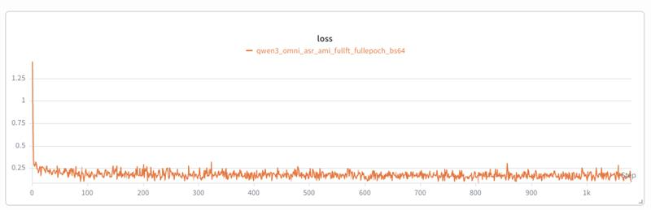

# Fine-Tune Qwen3-Omni for ASR

End-to-end ASR fine-tuning of `Qwen/Qwen3-Omni-30B-A3B-Instruct` on a
Hugging Face audio dataset, using the NeMo AutoModel VLM training stack. The
running example is the public
[`edinburghcstr/ami`](https://huggingface.co/datasets/edinburghcstr/ami)
meeting corpus (English IHM), but the same recipe works for any HF dataset
that exposes `{audio, text}` columns (AMI, LibriSpeech, GigaSpeech,
WenetSpeech, CommonVoice, …).

The workflow has two stages:

1. **Train** the thinker sub-model with the `FinetuneRecipeForVLM` recipe.
2. **Convert** the NeMo-saved thinker checkpoint into a Hugging Face-compatible
   Qwen3-Omni export so `transformers.AutoModel*` and vLLM can load it.

---

## Data Preparation

### Built-In Builder: `make_hf_audio_asr_dataset`

`nemo_automodel.components.datasets.vlm.datasets.make_hf_audio_asr_dataset`
returns a Hugging Face `Dataset` whose `__getitem__` lazily produces a single
`{"conversation": [...]}` dict suitable for `qwen3_omni_asr_collate_fn`. Key
design points:

* **`with_transform` for lazy decoding.** Building the dataset object is a
  constant-time metadata read; audio decode and chat-template assembly only
  run inside dataloader workers when a batch is fetched. Startup time is
  independent of split size.
* **Configurable prompt shape.** Defaults are `system_prompt=None` and
  `user_prompt=None`, yielding the minimal `user(audio) → assistant(text)`
  conversation. Setting either or both expands the conversation:
  `system_prompt="..."` adds a `system` turn, `user_prompt="..."` prepends a
  text item before the audio inside the user turn. Whitespace-only prompts
  are treated as absent.
* **Dataset-agnostic.** Accepts any HF audio dataset that exposes an audio
  column and a transcript column. Defaults (`audio_column="audio"`,
  `text_column="text"`, `name=None`) cover AMI, LibriSpeech, GigaSpeech, and
  WenetSpeech out of the box; per-dataset overrides go in the recipe YAML.

```python
from nemo_automodel.components.datasets.vlm.datasets import (
    make_hf_audio_asr_dataset,
)

dataset = make_hf_audio_asr_dataset(
    path_or_dataset="edinburghcstr/ami",
    name="ihm",
    split="train",
    sampling_rate=16000,
    user_prompt="Transcribe the English audio into text.",
)
# dataset[0]["conversation"] yields:
#   [
#     {"role": "user",      "content": [{"type": "text", "text": "Transcribe…"},
#                                       {"type": "audio", "audio": np.ndarray}]},
#     {"role": "assistant", "content": [{"type": "text", "text": "..."}]},
#   ]
```

### Built-In Collate: `qwen3_omni_asr_collate_fn`

`nemo_automodel.components.datasets.vlm.collate_fns.qwen3_omni_asr_collate_fn`
batches the lazy samples into model inputs without depending on
`qwen_omni_utils`:

* Walks each conversation for `{"type": "audio", "audio": <ndarray>}` items
  and feeds the raw waveforms straight to `Qwen3OmniMoeProcessor`'s
  `WhisperFeatureExtractor` (skipping the `process_mm_info` helper).
* Validates and coerces every audio payload through
  `_validate_and_coerce_audio_payload` (1-D `float32`; otherwise raises
  `ValueError` naming the sample index and offending shape/dtype).
* Pins `padding_side="right"` so the recipe's `count_tail_padding` token
  accounting works correctly.
* Reuses `build_labels_from_template` (marker-based; `Qwen3OmniMoeProcessor`
  is in `_IMSTART_TEMPLATE_PROCESSORS`) and emits pre-shifted labels.

The collate is selected through the YAML's `dataloader.collate_fn._target_`; it
is intentionally **not** registered in the global `COLLATE_FNS` map so the
existing `Qwen3OmniMoeProcessor → qwen3_omni_collate_fn` mapping keeps
serving non-ASR VLM users that *do* have `qwen_omni_utils` installed.

### Use a Different HF Audio Dataset

To target your own dataset, set `dataset.path_or_dataset` and override the
defaults below only when the dataset diverges:

| Dataset                                 | `path_or_dataset`                      | `name`                       | `text_column`     |
|-----------------------------------------|----------------------------------------|------------------------------|-------------------|
| `edinburghcstr/ami`                     | `edinburghcstr/ami`                    | `ihm` or `sdm`               | `text` (default)  |
| `openslr/librispeech_asr`               | `openslr/librispeech_asr`              | optional config              | `text` (default)  |
| `speechcolab/gigaspeech`                | `speechcolab/gigaspeech`               | optional config              | `text` (default)  |
| `mozilla-foundation/common_voice_*`     | `mozilla-foundation/common_voice_18_0` | language code (e.g., `en`)    | **`sentence`**    |

YAML override snippet for CommonVoice (note `text_column: sentence`):

```yaml
dataset:
  _target_: nemo_automodel.components.datasets.vlm.datasets.make_hf_audio_asr_dataset
  path_or_dataset: mozilla-foundation/common_voice_18_0
  name: en
  text_column: sentence
  split: train
  sampling_rate: 16000
```

Audio columns are universally named `audio` across these datasets, so the
default `audio_column="audio"` rarely needs an override.

---

## Train

### Example Config

`examples/audio_finetune/qwen3_omni_asr/ami_sft.yaml` is a ready-to-run full
fine-tune for the 30B-A3B Omni model on a single 8-GPU node, targeting the
public AMI IHM corpus. Defaults:

| Section            | Setting                                                                                |
|--------------------|----------------------------------------------------------------------------------------|
| `recipe`           | `FinetuneRecipeForVLM`                                                                 |
| `distributed`      | `fsdp2`, `ep_size=8`, `tp=cp=pp=1`                                                     |
| `freeze_config`    | `freeze_vision_tower=true`, `freeze_audio_tower=false`, `freeze_language_model=false`  |
| `step_scheduler`   | `global_batch_size=64`, `local_batch_size=8`, `ckpt_every_steps=200`, `num_epochs=1`   |
| `optimizer`        | `AdamW(lr=2.0e-5, betas=[0.9, 0.95], weight_decay=0.0)`                                |
| `checkpoint`       | `result/checkpoints/...`, `model_save_format=safetensors`, `save_consolidated=true`    |
| `dataset`          | `make_hf_audio_asr_dataset(path_or_dataset="edinburghcstr/ami", name="ihm")`           |

`peft:` is intentionally omitted — both the language model and the audio
tower are trainable; the vision tower stays frozen. With `ep_size=8`, the MoE
experts are sharded across all 8 GPUs.

Measured on 8x H100 80 GB: ~1.4 step/s steady-state, ~36–40 GB peak/GPU.
One epoch over the ~69k post-1.0s-filter AMI IHM train clips finishes in
~22 min (compared to ~2 h at `local_batch_size=1`). Peak memory on this MoE is
dominated by FSDP/expert all-gather (~36 GB), not by activations, so the batch
size can be pushed this high without OOM.


### Launch

Use the standard NeMo AutoModel CLI:

```bash
torchrun --nproc_per_node=8 --nnodes=1 -m nemo_automodel.cli.app \
    examples/audio_finetune/qwen3_omni_asr/ami_sft.yaml
```

Any per-field CLI override (e.g., `--dataset.split 'train[:5000]'`) is
forwarded to the YAML. Optional WandB logging streams online as long as
`WANDB_API_KEY` is set in the environment; set `WANDB_MODE=offline` for a
dry run.

### What Gets Saved

Every `ckpt_every_steps` steps the recipe writes a consolidated checkpoint:

```
epoch_E_step_S/
├── config.yaml                # snapshot of the recipe config
├── losses.json
├── dataloader/                # StatefulDataLoader state for restart
├── optim/                     # AdamW state (~30 GB / shard for 30B FT)
├── rng/                       # PyTorch + numpy + python RNG state
├── step_scheduler.pt
└── model/
    ├── shard-XXXXX-model-00001-of-00001.safetensors  # DCP sharded
    ├── consolidated/                                  # HF-format export
    │   ├── config.json                               # thinker subtree only
    │   ├── model.safetensors.index.json
    │   ├── model-00001-of-00013.safetensors
    │   └── ...
    └── chat_template.jinja, tokenizer*.json, processor_config.json
```

The `consolidated/` directory is the artifact to use for inference. It already
holds the trained weights and the right tokenizer + processor — but its
`config.json` describes the *thinker sub-model only*
(`model_type=qwen3_omni_moe_thinker`), which neither `transformers.AutoConfig`
nor vLLM recognizes as a top-level architecture. See the Convert section for the
conversion step.

### Resume

`--checkpoint.restore_from <ckpt_dir>` reloads the model state, optimizer,
RNG, and dataloader position. Full-FT checkpoints are loaded directly into
the sharded model parts. The recipe does not require the conversion step
below for restart — only for *external* inference tooling.

---

## Convert: Thinker → HF-Compatible Omni

NeMo maps `Qwen3OmniMoeForConditionalGeneration` to a custom *thinker-only*
class (the parent Omni model in HF has `thinker / code2wav / talker`
sub-modules; this recipe only needs the thinker for ASR). The saved
`consolidated/config.json` therefore carries
`model_type=qwen3_omni_moe_thinker`, which is **not registered as a top-level
architecture** in `transformers.CONFIG_MAPPING`. Loading it directly will
fail with:

```text
ValueError: The checkpoint you are trying to load has model type
`qwen3_omni_moe_thinker` but Transformers does not recognize this architecture.
```

### Tool: `tools/wrap_thinker_ckpt_as_omni.py`

`tools/wrap_thinker_ckpt_as_omni.py` rewraps the thinker checkpoint as a
full Qwen3-Omni export by:

1. Renaming + copying the trained `thinker.*` shards into the output dir.
2. Copying the untrained `code2wav.*` and `talker.*` shards verbatim from
   the cached HF base model (these were never modified during ASR training).
3. Writing a merged `model.safetensors.index.json` across all three buckets.
4. Replacing the bogus `config.json` with the base model's
   (`model_type=qwen3_omni_moe`,
   `architectures=["Qwen3OmniMoeForConditionalGeneration"]`).
5. Copying the rest of the HF metadata (tokenizer, processor, generation
   config, chat template) from the base; the recipe-saved `chat_template.jinja`
   wins if present.

Memory footprint stays at roughly one shard (~5 GB) at a time — no full-model
materialisation.

```bash
python tools/wrap_thinker_ckpt_as_omni.py \
    --ckpt-dir   result/checkpoints/<run>/epoch_0_step_199/model/consolidated \
    --base-dir   ~/.cache/huggingface/hub/models--Qwen--Qwen3-Omni-30B-A3B-Instruct/snapshots/<rev> \
    --out-dir    /tmp/qwen3_omni_asr_step_199_wrapped
```

The output directory is a drop-in replacement for the public Qwen3-Omni
snapshot — only the `thinker.*` weights differ.

---

## Results: AMI IHM

End-of-epoch evaluation on the AMI IHM `test` split, comparing the
zero-shot base Qwen3-Omni against the same model after one epoch of full
fine-tuning with the recipe above (audio tower trainable). WER drops by
roughly half:



| Stage           | Model                                                 | WER (AMI IHM test) |
|-----------------|-------------------------------------------------------|--------------------|
| Before training | Base `Qwen/Qwen3-Omni-30B-A3B-Instruct` (zero-shot)   | 15.81%             |
| After training  | 1 epoch full FT (audio tower trainable)               | **8.31%**          |
