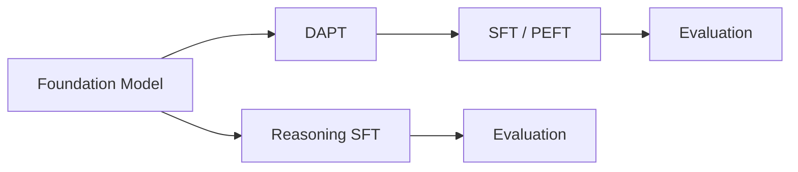

# NeMo AutoModel Tutorials

End-to-end tutorials covering the LLM customization lifecycle using [NeMo AutoModel](https://github.com/NVIDIA-NeMo/Automodel).

| Tutorial | Dataset | Description | Instance Type | Launch on Brev |
| --- | --- | --- | --- | --- |
| Domain Adaptive Pre-Training (DAPT) | Domain-specific text corpus | Continued pre-training of a foundation model on domain data to improve in-domain performance. | Coming soon | Coming soon |
| Supervised Fine-Tuning (SFT) | Instruction tuning data | Full-parameter fine-tuning to adapt a pre-trained model to follow instructions. | Coming soon | Coming soon |
| [**Parameter-Efficient Fine-Tuning (PEFT)**](./llama-peft/finetune.ipynb) | [SQuAD](https://huggingface.co/datasets/rajpurkar/squad) | Memory-efficient LoRA fine-tuning for task adaptation. | L40S |  |
| Evaluation | Standard benchmarks | Evaluate AutoModel checkpoints with lm-evaluation-harness. | Coming soon | Coming soon |
| Reasoning SFT | Reasoning instruction data | Fine-tune a model to selectively enable chain-of-thought reasoning via system prompt control. | Coming soon | Coming soon |
| [**Nemotron Parse Fine-Tuning**](./nemotron-parse/finetune.ipynb) | [Invoices](https://huggingface.co/datasets/katanaml-org/invoices-donut-data-v1) | Fine-tune Nemotron Parse v1.1 for structured document extraction. | L40S |  |

## Prerequisites

- [NeMo AutoModel](https://github.com/NVIDIA-NeMo/Automodel) installed (see the AutoModel README for setup instructions).
- NVIDIA GPU(s) with sufficient memory (specific requirements noted per tutorial).
- A [Hugging Face](https://huggingface.co/) account and API token for accessing gated models such as Llama.
- Access to tutorial data from the [Hugging Face Datasets Hub](https://huggingface.co/datasets) or your own local JSONL/bin-idx datasets, depending on the tutorial.

## Pipeline Overview

These tutorials cover four stages of the LLM customization lifecycle:

- **DAPT**: Inject domain knowledge via continued pre-training.
- **SFT / PEFT**: Teach the model to follow instructions or solve specific tasks.
- **Reasoning SFT**: Teach the model chain-of-thought reasoning with on/off control.
- **Evaluation**: Measure quality on standard benchmarks after each stage.

For reinforcement learning from human feedback (RLHF / DPO / PPO), see [NeMo-RL](https://github.com/NVIDIA/NeMo-RL).
